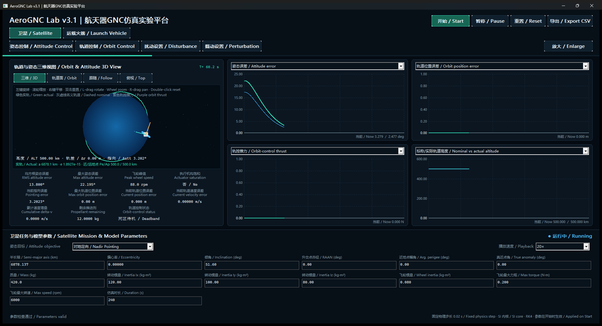
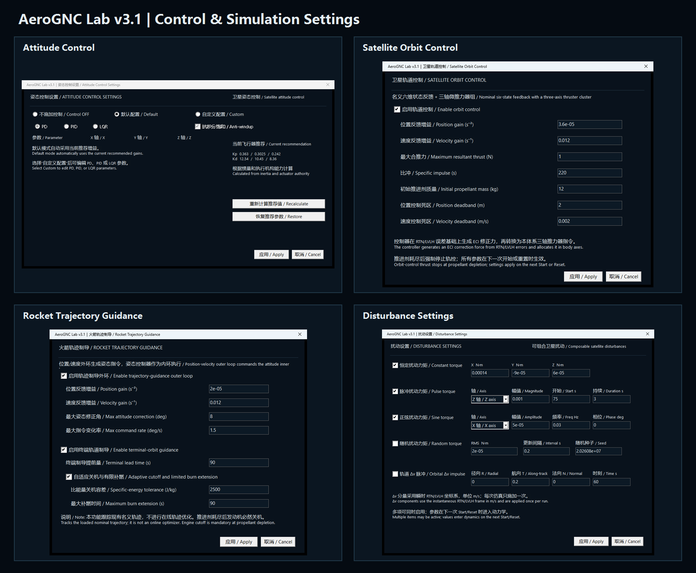

# AeroGNC Lab v3.1｜航天器GNC仿真实验平台

[](https://github.com/zhaoyun20180911/AeroGNC-Lab/releases)
[](https://github.com/zhaoyun20180911/AeroGNC-Lab/actions/workflows/windows-build.yml)


[](LICENSE)

AeroGNC Lab v3.1 是使用 C++20 和原生 Win32/GDI 构建的中英双语桌面仿真实验平台，提供卫星姿态与轨道闭环控制、运载火箭轨迹制导、扰动配置、交互式三维技术视图、实时曲线和 CSV 数据导出。

This is a bilingual native C++20 Windows desktop simulation platform for satellite attitude/orbit control and launch-vehicle trajectory guidance. It includes interactive 3D technical views, configurable control and disturbance models, real-time plots, and CSV export.

## 下载 / Downloads

| 版本 | 适用对象 | 下载与说明 |
|---|---|---|
| **Windows x64 免安装封装版（推荐）** | 希望直接体验软件的用户 | [下载封装版](https://github.com/zhaoyun20180911/AeroGNC-Lab/releases/download/v3.1.0/AeroGNC_Lab_v3.1_Windows_x64_Portable.zip)；下载并解压后无需安装，双击 EXE 即可运行。 |
| **可编辑源码版** | 学习、验证和二次开发 | [下载源码版](https://github.com/zhaoyun20180911/AeroGNC-Lab/releases/download/v3.1.0/AeroGNC_Lab_v3.1_Source.zip)；需要 Windows、Visual Studio 2022、CMake 和 C++ 开发环境。 |

> 封装版面向 Windows 10/11 x64，已静态链接 MSVC 运行库并内嵌七个任务 CSV。当前未使用商业代码签名证书，首次运行时 Windows SmartScreen 可能显示“未知发布者”；请从本仓库 Release 下载并核对其中的 SHA-256。

## 软件界面 / Interface



## 功能设置 / Control and simulation settings



## 源码运行 / Run from source

双击项目根目录中的 `运行 AerospaceGNC.bat`。脚本优先启动已经编译好的 `build/Release/AerospaceGNC.exe`；如果可执行文件不存在，会先调用本机的 CMake 与 Visual Studio 2022 重新构建。

Double-click `运行 AerospaceGNC.bat`. It launches the existing Release executable, or builds it first when needed.

重新编译并执行测试可双击 `构建并测试.bat`，也可以运行：

```powershell
cmake -S . -B build -A x64
cmake --build build --config Release --parallel
ctest --test-dir build -C Release --output-on-failure
```

## 免安装便携版 / Standalone portable build

双击 `生成便携版.bat` 可重新构建并在 `dist/` 生成。命令行方式为：

```powershell
powershell.exe -NoProfile -ExecutionPolicy Bypass -File .\scripts\package_portable.ps1
```

- `AeroGNC_Lab_v3.1_Windows_x64.exe`：可单独复制到其他 Windows 10/11 x64 电脑运行的单文件版。
- `AeroGNC_Lab_v3.1_Windows_x64_Portable.zip`：包含同一 EXE、使用说明和 SHA-256 校验值。

便携构建使用静态 MSVC 运行库，只依赖 Windows 自带的系统 DLL；七个只读任务 CSV 作为原始字节嵌入 EXE。开发环境仍优先读取项目 `data/rocket_missions/`，外部目录不存在时自动使用内嵌数据。当前文件没有商业代码签名证书，因此陌生电脑首次运行时可能出现 Windows SmartScreen“未知发布者”提示。

## 3.1 功能 / Version 3.1 features

- 全部可见参数、选项、按钮、状态与指标采用中英双语。
- 卫星支持六个经典轨道根数、质量/惯量/飞轮参数，以及对地定向、惯性定向、目标跟踪和姿态机动四种任务。
- 火箭仅允许选择 3 个发射场 × 2 个目标轨道，共 6 个合法固定任务；标称质量、推力、比冲、惯量和 TVC 参数只读。
- 火箭用户输入是 Truth Model 偏差：质量、惯量、推力、比冲、阻力系数、大气密度及 TVC 零偏。
- 标称轨迹从只读 CSV 插值；位置/速度线性插值，四元数使用符号连续处理与 SLERP。文件结束后标称和实际状态分别进行二体轨道滑行，实际状态不会吸附回标称轨迹。
- 场景选择和功能设置分为上下两行；“卫星 / Satellite”“运载火箭 / Launch Vehicle”位于上层，“姿态控制 / Attitude Control”等当前场景功能位于下层。
- 姿态控制设置支持关闭、默认和自定义；自定义可选 PD、带抗积分饱和的 PID 或 LQR 状态反馈，并根据惯量和执行机构能力给出动态推荐值。
- 卫星新增位置/速度六状态轨道控制外环与三轴微推力器组，独立传播名义轨道和实际轨道，并计入推力限幅、推进剂消耗、比冲和耗尽强制停机。
- 卫星扰动可组合恒定、脉冲、正弦和随机力矩，并可注入一次性 RTN/LVLH 轨道 Δv 脉冲；火箭扰动可组合稳态侧风、阵风、脉冲力、脉冲力矩和随机扰动。
- 卫星摄动设置保留 J2、大气阻力、月球/太阳三体引力和太阳光压占位项，全部明确标注“未启用 / Not enabled”，不进入当前动力学。
- 状态驱动的交互 3D 技术视图支持左键旋转、滚轮缩放、右键平移、双击复位与相机预设；卫星实轨按统一物理比例绘制，半长轴和偏心率会改变地球/轨道相对尺寸及轨道形状。
- 火箭提供局部上升与地心全球轨道两种视图，入轨后自动切换到全球视图，连续展示上升、入轨点、目标轨道和入轨后滑行轨迹。
- 火箭爬升跟踪误差在入轨时冻结，滑行段只继续传播原始状态和实际轨道量；实时图采用 1/2/5 友好刻度、明确零刻度线及按物理含义约束的纵轴范围。
- 播放速度固定为 0.25×、0.5×、1×、2×、5×、10×、20×、50×、100× 和最快模式；物理积分步长保持 0.02 s。
- CSV 导出包含参考/实际状态、误差、控制量、执行机构、任务阶段、轨道滑行标志及爬升跟踪有效标志；卫星 CSV 另含 RTN 位置/速度误差、轨控推力、推进剂、累计 Δv 与脉冲状态。

## v3.1 卫星闭环轨道控制 / Satellite closed-loop orbit control

- 实际轨道和未受扰名义轨道分别采用二体 RK4 传播；轨控器不重新在线规划轨道，而是反馈修正二者的位置、速度偏差。
- 控制器根据 RTN/LVLH 六状态误差生成 ECI 修正加速度，再转换为本体系三轴推力器指令；卫星姿态任务继续由反作用飞轮独立执行。
- “轨道控制 / Orbit Control”窗口可设置位置/速度增益、合推力上限、比冲、初始推进剂和位置/速度死区。
- 主界面提供轨道位置/速度误差、径向/航向/法向误差、轨控推力、推进剂、累计 Δv、比能量及轨道根数误差曲线，并在三维视图同时标出名义位置和实际位置。
- 自动测试验证一次 0.20 m/s 航向脉冲后，闭环在 1200 s 时将位置误差从开环约 251.5 m 降至约 0.21 m。

## 火箭闭环轨迹制导 / Rocket closed-loop trajectory guidance

- 火箭现在采用“位置/速度轨迹制导外环 → 姿态控制内环 → TVC/RCS 执行机构”的串级结构；PD、PID、LQR 仍负责姿态内环，不进行在线轨迹优化。
- 每一级推进剂独立记账。推进剂耗尽即强制关机，级间分离会丢弃一级干质量和一级残余推进剂，不再允许发动机在干质量下限继续产生推力。
- 二级末段提供目标轨道比能量制导、自适应关机与有限补燃，以处理推力和比冲等真值偏差；修正角和指令变化率均有限幅。
- 主界面新增“轨迹制导 / Guidance”设置、制导状态、剩余推进剂，以及径向/航向误差、制导修正角、推进剂余量和轨道比能量误差曲线；CSV 同步导出这些量。
- 入轨快照以发动机实际关机为准，终端轨道根数相对固定目标轨道计算；入轨后不再继续累计爬升轨迹误差。

- The launch vehicle now uses a cascaded position/velocity guidance outer loop, attitude-control inner loop, and TVC/RCS actuators. It tracks the loaded nominal trajectory rather than solving a new trajectory online.
- Propellant is tracked independently per stage, with mandatory cutoff at depletion and physically consistent stage separation.
- Terminal specific-energy guidance supports adaptive cutoff and bounded burn extension under truth-model deviations.

## 任务数据 / Mission data

七个原始 CSV 位于 `data/rocket_missions/`。它们是运行时只读输入，构建后会原样复制到可执行文件旁的 `data/rocket_missions/`。程序不会重新生成或覆盖这些文件。映射和字段说明见 `docs/mission_data.md`。

## 工程说明 / Engineering notes

- 架构：[docs/architecture.md](docs/architecture.md)
- 坐标与单位：[docs/conventions.md](docs/conventions.md)
- 火箭模型：[docs/rocket_model.md](docs/rocket_model.md)
- 卫星模型：[docs/satellite_model.md](docs/satellite_model.md)
- 控制与扰动：[docs/control_and_disturbance.md](docs/control_and_disturbance.md)
- 验证记录：[docs/validation.md](docs/validation.md)

## 使用范围与免责声明 / Scope and disclaimer

本项目用于教学、科研演示、控制算法理解和软件仿真实验。模型包含明确的工程简化，不是经过飞行鉴定的任务分析或控制软件，不得用于真实航天器、运载火箭、安全关键系统或任何需要适航/飞行认证的决策。

This project is intended for education, research demonstrations, control-algorithm study, and software simulation. It is not flight-qualified and must not be used for real spacecraft, launch vehicles, safety-critical systems, or certified mission decisions.

## 许可证 / License

源代码采用 [MIT License](LICENSE) 发布。七个任务数据随项目提供，用于运行、验证和复现实验。
